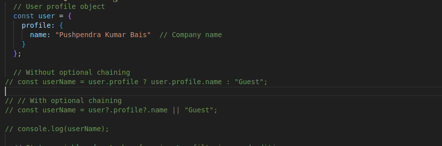

## Q1. How long did you spend on the coding test?
I spent approximately 5-6 hours on the coding test.

## Q2. What was the most useful feature that was added to the latest version of your chosen language? Please include a snippet of code that shows how you've used it.
One of the valuable new features in recent JavaScript versions is optional chaining. This feature makes it easier to safely access properties within deeply nested objects without running into errors if any part of the chain is undefined or null. This helps prevent issues when trying to retrieve properties that may not be present.

### Code Snippet:

## Q3. How would you track down a performance issue in production? Have you ever had to do this?

To address performance issues in production, various strategies can help optimize the `TaskManager` component. Using monitoring tools like Chrome DevTools can identify resource-heavy parts of the app. Checking `useEffect` dependencies helps prevent unnecessary re-renders. Expensive operations, such as filtering tasks, can be optimized using `useMemo` to avoid recalculations. Lazy loading and code splitting are effective for larger applications.

## Q4. If you had more time, what additional features or improvements would you consider adding to the task management application?

If I had more time, I would add several features to improve the task management app. These include:
- **User Authentication and Profiles** for personalized task management.
- **Backend Integration** to store tasks in a scalable database.
- **Task Sorting** by priority, due date, and status, along with **drag-and-drop reordering** to enhance usability.
- **Notifications and Reminders** for timely updates on tasks.
- **Categories and Labels** to improve task organization.
- **Collaboration Features** like task comments and sharing.
- **Advanced Search and Filtering** for easier task management.
- **Additional Enhancements** such as task dependencies, mobile responsiveness, dark mode, analytics, data backup, sync, and keyboard shortcuts to streamline and optimize the app.

